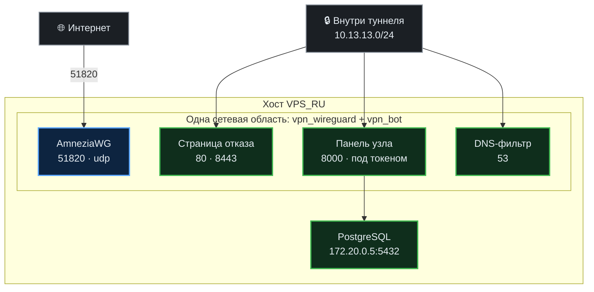
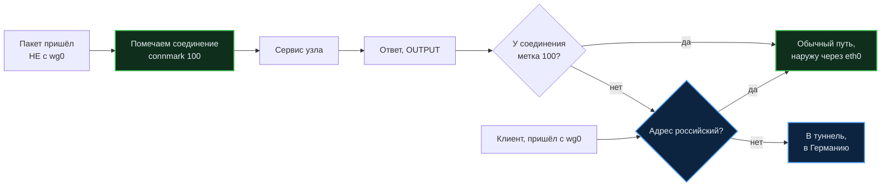

# Карта портов и сетевых границ

Кто на каком порту сидит, что видно из интернета, а что нет, и почему именно
так. Написано для человека, который собирается что-то открыть, закрыть или
перенести, — чтобы он не наступил туда, куда мы уже наступали.

Главное, что нужно знать до всего остального:

> **Бот и узел делят одну сетевую область.** В `docker-compose.yml` у бота
> стоит `network_mode: "service:ru_wireguard"`, и это не мелочь: у двух
> контейнеров **один набор портов на двоих**. Порт, занятый страницей отказа,
> для бота тоже занят.

На этом мы уже обожглись: сервис поставили на 8443, где стоит HTTPS-страница
отказа, обновление не прошло проверку и откатилось.

---

## Что видно из интернета

Только это. Всё остальное на публичном адресе закрыто.

| Порт | Кто слушает | Зачем именно он |
|---|---|---|
| `51820/udp` | AmneziaWG | вход туннеля |
| `80/tcp` | certbot, только на время выпуска | проверка Let's Encrypt при выпуске сертификата узла |
| `23232/tcp` | SSH | перенесён с 22, чтобы не собирать перебор паролей |

Свой Xray убран целиком: вход на 443, запасные 2053 и 2083, подписка наружу на
2096. Правила `ufw` на эти порты снимает недельное обслуживание хоста, как
только убедится, что их никто не слушает (`scripts/ensure_host_maintenance.sh`).
Прежнюю охрану порта подписки — цепочку `VPN_SUB` в `DOCKER-USER` — снимает
`scripts/public_sub.sh` при любом вызове.

---

## Что живёт внутри и наружу не публикуется

| Порт | Кто слушает | Кому доступен |
|---|---|---|
| `53/udp` | DNS-фильтр узла | только туннелю, и только тем, у кого включены фильтры |
| `80/tcp` | страница отказа, http | только туннелю |
| `8443/tcp` | страница отказа, https | только туннелю; на него заворачивается 443 |
| `8000/tcp` | панель узла | туннелю, и то под токеном |
| `5432/tcp` | PostgreSQL | только сети контейнеров `172.20.0.5` |

**Почему страница отказа на 8443, а не на 443.** Запрос к закрытому ресурсу по
HTTPS заворачивается правилом `443 → 8443`, и человек видит объяснение, а не
таймаут. Сам 443 в сетевой области узла держим свободным: на нём встанет вход
панели Xray, когда она появится. Страница, занявшая 443, не дала бы ему
подняться — это стережёт `tests/node/port_conflict_test.py`.

---

## Схема: кто где слушает

---

## Сертификат узла

Нужен странице отказа: на свои имена («дом.example.ru») она открывается без
предупреждения браузера. Нет сертификата — страница работает на
самоподписанном.

Выпускает и продлевает его `scripts/public_sub.sh` на хосте; из бота —
«Администрирование → Домен и сертификаты». На что выпускается:

- есть домен и доступ к его зоне — на имя и все поддомены, проверка через DNS;
- есть только домен — на имя, 90 дней;
- домена нет — прямо на IP-адрес: с 15 января 2026 Let's Encrypt это умеет
  профилем `shortlived`, срок 160 часов, поэтому продление стоит таймером
  дважды в сутки.

---

## Ответы наружу: почему узел отвечал только россиянам

Самая неочевидная ловушка проекта, и найти её удалось только сквозной проверкой
с немецкой ноды.

Узел отправляет в Германию всё, что идёт **не на российский адрес** — так
устроен обход блокировок. Но под то же правило попадали и **ответы на входящие
соединения**: человек с зарубежного адреса стучится на узел, сервис отвечает,
ответ видит «адрес не российский» и уходит в туннель. Рукопожатие не
складывается никогда.

Снаружи это выглядело как закрытые порты: SSH (он живёт на хосте, мимо этих
правил) отвечал, а сервисы в сетевой области узла — нет. Российские адреса
подключались нормально — поэтому заметить было неоткуда.

**Лечится пометкой самого соединения:**

Две тонкости, на которых это ломается:

1. **Пометка должна стоять ПЕРВЫМ правилом в `PREROUTING`.** Выше по цепочке
   идут `RETURN` для частных сетей, а адрес самого контейнера — `172.20.0.6` —
   попадает в `172.16.0.0/12`. Пакет выходил из цепочки раньше, чем доходил до
   пометки; счётчик показывал ноль.
2. **Клиентский трафик не должен помечаться.** Он приходит с `wg0`, и пометка
   ставится только для остальных — иначе обход блокировок перестал бы работать
   у всех сразу.

Исходящее самого узла не задето: его соединения рождаются в `OUTPUT` и в
`PREROUTING` не попадают, так что бот по-прежнему ходит в Telegram через
Германию. По тем же правилам уйдёт в Германию и любой будущий сервис, живущий в
этой сетевой области.

Проверка: `tests/node/reply_path_test.py`.

---

## Если надо открыть ещё один порт

1. **Проверьте, свободен ли он в сетевой области узла** — список выше, и он
   общий для бота и узла.
2. **Публикуйте в `docker-compose.yml`** у сервиса `ru_wireguard`, даже если
   слушает бот: сеть у них одна.
3. **Охрану ставьте в `DOCKER-USER`**, не в `ufw`: на опубликованные порты
   контейнеров `ufw` не действует вовсе — Docker пишет свои правила раньше.
4. **Проверьте снаружи, а не с узла.** С самого узла порт отвечает всегда
   (это обращение к себе). Настоящая проверка — с другой машины, у которой
   зарубежный адрес: на этом и поймали ловушку с ответами.
5. **Не рассчитывайте на бит запуска** у скриптов в общей папке `scripts/`:
   обновление раздаёт права только внутри папки ноды. Вызывайте через `bash`, а
   в `systemd`-юнитах пишите `ExecStart=/bin/bash /путь/скрипт.sh`.

## Куда смотреть, когда сломалось

    bash scripts/public_sub.sh status     # сертификат узла
    ss -lntp                              # кто на самом деле слушает
    docker exec vpn_wireguard ss -lntp    # то же внутри сетевой области

Подробнее про разбор поломок — в [RUNBOOK.md](../RUNBOOK.md).
