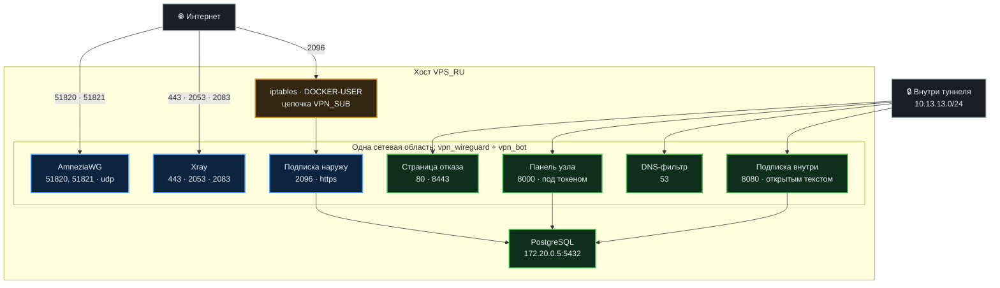
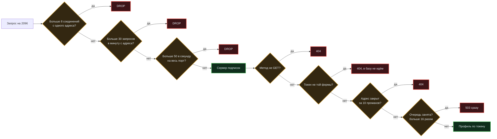
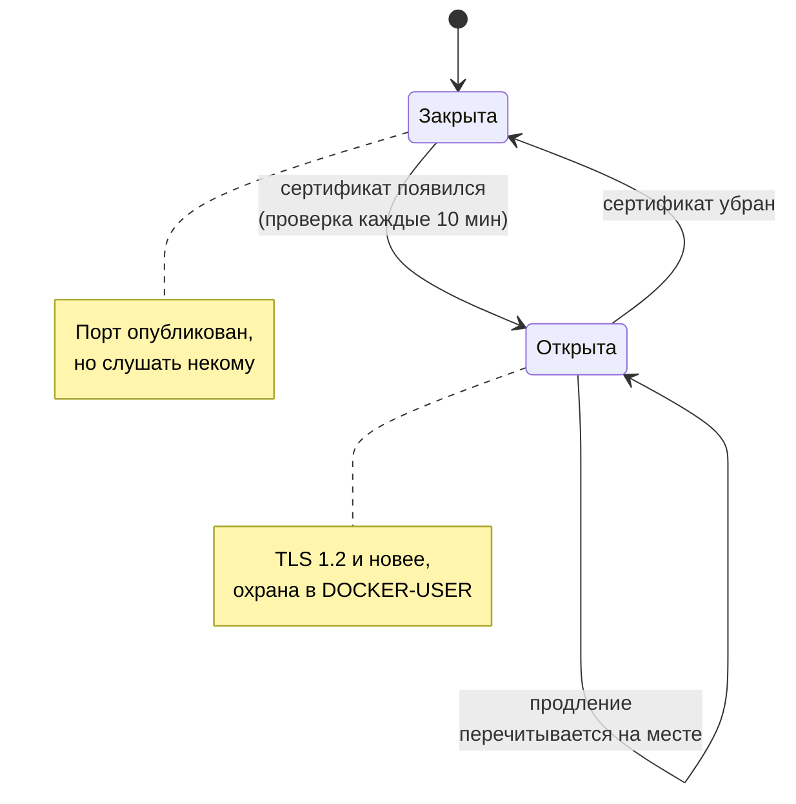
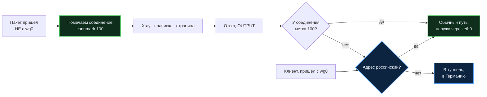

# Карта портов и сетевых границ

Кто на каком порту сидит, что видно из интернета, а что нет, и почему именно
так. Написано для человека, который собирается что-то открыть, закрыть или
перенести, — чтобы он не наступил туда, куда мы уже наступали.

Главное, что нужно знать до всего остального:

> **Бот и узел делят одну сетевую область.** В `docker-compose.yml` у бота
> стоит `network_mode: "service:ru_wireguard"`, и это не мелочь: у двух
> контейнеров **один набор портов на двоих**. Порт, занятый страницей отказа,
> для бота тоже занят.

На этом мы уже обожглись: подписку наружу поставили на 8443, где стоит
HTTPS-страница отказа, обновление не прошло проверку и откатилось.

---

## Что видно из интернета

Только это. Всё остальное на публичном адресе закрыто.

| Порт | Кто слушает | Зачем именно он |
|---|---|---|
| `51820/udp` | AmneziaWG | основной вход туннеля |
| `51821/udp` | AmneziaWG, второй интерфейс | поднимается только на время переезда на новый ключ сервера |
| `443/tcp` | Xray | трафик к нему неотличим от обычного HTTPS, а блокировка ломает провайдеру половину интернета |
| `2053/tcp` | Xray, запасной вход | общеизвестный запасной HTTPS, своя маска |
| `2083/tcp` | Xray, запасной вход | то же, маска другая — чтобы входы не падали вместе |
| `2096/tcp` | подписка наружу | тоже запасной HTTPS; слушается **только пока лежит сертификат** |
| `23232/tcp` | SSH | перенесён с 22, чтобы не собирать перебор паролей |

Почему подписка на 2096, а не на 8443: тот занят страницей отказа (см. ниже), а
среди 2053 и 2083 новый номер из того же ряда не выделяется.

---

## Что живёт внутри и наружу не публикуется

| Порт | Кто слушает | Кому доступен |
|---|---|---|
| `53/udp` | DNS-фильтр узла | только туннелю, и только тем, у кого включены фильтры |
| `80/tcp` | страница отказа, http | только туннелю |
| `8443/tcp` | страница отказа, https | только туннелю; на него заворачивается 443 |
| `8000/tcp` | панель узла | туннелю, и то под токеном |
| `8080/tcp` | подписка внутри туннеля | туннелю; открытым текстом, и это нормально — туннель уже шифрует |
| `8444/tcp` | сайт-заглушка и подписка | **только петле**; наружу её показывает Xray тем, кто пришёл без ключа — и через неё же подписка попадает на 443 |
| `5432/tcp` | PostgreSQL | только сети контейнеров `172.20.0.5` |

**Почему страница отказа на 8443, а не на 443.** Сам 443 отдан входу Xray, и это
не обсуждается: на нём держится вся маскировка. Поэтому запрос к закрытому
ресурсу по HTTPS заворачивается правилом `443 → 8443` — человек видит объяснение,
а не таймаут.

---

## Схема: кто где слушает

---

## Охрана порта подписки

Правила стоят в цепочке `VPN_SUB`, зацепленной в `DOCKER-USER`. **Не в `ufw`** —
и это важнее, чем кажется.

> На опубликованные порты контейнеров `ufw` не действует вовсе. Docker пишет
> свои правила в `PREROUTING` и `FORWARD` раньше и `ufw` не спрашивает. Запрет,
> написанный в `ufw`, выглядит защитой, не будучи ей.

`DOCKER-USER` — единственная цепочка, которую Docker зовёт сам и своими
правилами не перекрывает.

**Почему `DROP`, а не `REJECT`.** Молчание не стоит нам ничего и говорит сканеру
меньше: по нему он не отличит закрытый порт от занятого.

**Почему отказ всегда одинаковый.** По ответу нельзя отличить «нет такого
токена» от «слишком часто» и от «закрыт». Разные ответы — это карта, по которой
подбирают, куда давить.

**Почему у счётчиков есть потолок.** Без него скан с тысяч адресов набил бы
словарь до отказа памяти. Память — такой же ресурс, как процессор.

---

## Подписка наружу: чем держится безопасность

Настройки у этого нет намеренно, и это не упрощение.

> Внешний порт опубликован всегда, но бот слушает его **только пока рядом лежит
> действующий сертификат**. Нет сертификата — нет сокета: снаружи порт молчит
> как закрытый.

Настройка, которую можно забыть выставить или выставить не так, сама была бы
способом однажды отдать подписку открытым текстом. Здесь такого способа нет.

Сертификат выдаётся **прямо на IP-адрес**: с 15 января 2026 Let's Encrypt это
умеет, домен не нужен и покупать ничего не надо. Живёт он 160 часов — неделю без
восьми часов, — поэтому продление стоит таймером дважды в сутки, а не раз в два
месяца.

Профиль обязан быть `shortlived`: остальные профили IP не принимают вовсе.
Проверка — только `http-01` или `tls-alpn-01`: `DNS-01` для адреса невозможен по
определению.

---

## Ответы наружу: почему узел отвечал только россиянам

Самая неочевидная ловушка проекта, и найти её удалось только сквозной проверкой
с немецкой ноды.

Узел отправляет в Германию всё, что идёт **не на российский адрес** — так
устроен обход блокировок. Но под то же правило попадали и **ответы на входящие
соединения**: человек с зарубежного адреса стучится на 443, Xray отвечает, ответ
видит «адрес не российский» и уходит в туннель. Рукопожатие не складывается
никогда.

Снаружи это выглядело как закрытые порты:

| Откуда | SSH 23232 | 443 · 2053 · 2083 · 2096 |
|---|---|---|
| российский адрес | отвечает | отвечает |
| зарубежный адрес | отвечает | **молчал** |

SSH отвечал потому, что живёт на хосте и этих правил не касается. Российские
адреса подключались нормально — поэтому заметить было неоткуда.

**Лечится пометкой самого соединения:**

Две тонкости, на которых это ломается:

1. **Пометка должна стоять ПЕРВЫМ правилом в `PREROUTING`.** Выше по цепочке
   идут `RETURN` для частных сетей, а адрес самого контейнера — `172.20.0.6` —
   попадает в `172.16.0.0/12`. Пакет выходил из цепочки раньше, чем доходил до
   пометки; счётчик показывал ноль.
2. **Клиентский трафик не должен помечаться.** Он приходит с `wg0`, и пометка
   ставится только для остальных — иначе обход блокировок перестал бы работать
   у всех сразу.

Исходящее самого узла не задето: его соединения рождаются в `OUTPUT` и в
`PREROUTING` не попадают, так что бот по-прежнему ходит в Telegram через
Германию.

Проверка: `tests/node/reply_path_test.py`.

---

## Если надо открыть ещё один порт

1. **Проверьте, свободен ли он в сетевой области узла** — список выше, и он
   общий для бота и узла. Есть тест: `tests/bot/pubsub_guard_test.py`.
2. **Публикуйте в `docker-compose.yml`** у сервиса `ru_wireguard`, даже если
   слушает бот: сеть у них одна.
3. **Охрану ставьте в `DOCKER-USER`**, не в `ufw`.
4. **Проверьте снаружи, а не с узла.** С самого узла порт отвечает всегда
   (это обращение к себе). Настоящая проверка — с другой машины, у которой
   зарубежный адрес: на этом и поймали ловушку с ответами.
5. **Не рассчитывайте на бит запуска** у скриптов в общей папке `scripts/`:
   обновление раздаёт права только внутри папки ноды. Вызывайте через `bash`, а
   в `systemd`-юнитах пишите `ExecStart=/bin/bash /путь/скрипт.sh`.

## Куда смотреть, когда сломалось

    bash scripts/public_sub.sh status     # сертификат и правила разом
    iptables -L VPN_SUB -n -v             # три правила DROP
    iptables -S DOCKER-USER | head        # первой строкой прыжок в VPN_SUB
    ss -lntp                              # кто на самом деле слушает
    docker exec vpn_wireguard ss -lntp    # то же внутри сетевой области

Подробнее про разбор поломок — в [RUNBOOK.md](../RUNBOOK.md).
