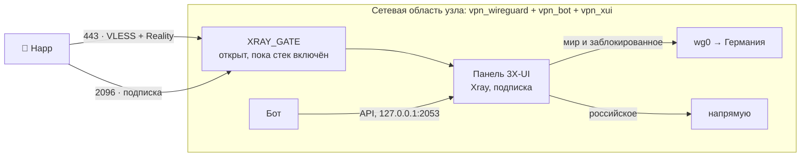

# Xray: второй канал через панель 3X-UI

Второй способ подключения рядом с AmneziaWG. Не свой Xray, а готовая панель
[3X-UI](https://github.com/MHSanaei/3x-ui): входы, подписки, статистика и
шаблоны под блокировки в ней уже есть и обновляются сообществом. Бот управляет
ею по API и настраивает сам — руками в панель лезть не нужно, но можно.

Необязателен. Выключен по умолчанию: без него проект работает на одном
AmneziaWG, как работал.

## Как устроено

- **Контейнер `vpn_xui`** — официальный образ `ghcr.io/mhsanaei/3x-ui` с
  закреплённой версией (`VPS_RU/docker-compose.yml`). Обновляется вместе с
  проектом: новая версия панели — новая строка в compose и обычная выкладка.
- **Сеть общая с узлом.** Поэтому исходящий трафик Xray идёт по правилам узла
  сам: российские адреса — напрямую, остальное и заблокированное — через
  Германию, ответы на входящие — обратно тем же путём. Своего моста в Германию
  у Xray нет и не нужно.
- **Порты** 443 (вход) и 2096 (подписка) публикует `vpn_wireguard`. Пропускает
  их цепочка `XRAY_GATE` на узле — только пока стек включён. Панель на 2053
  наружу не публикуется; из туннеля к ней пускает цепочка `XUI_PANEL` — только
  с адресов ключей владельца.
- **Fail2ban панели выключен**: он правит iptables, а таблицы здесь общие с
  узлом и принадлежат ему.

## Включение и выключение

«Администрирование → Протоколы → Включить Xray». Под капотом одна строка в
`.env` — `COMPOSE_PROFILES=xray`. Её пишет бот, хост поднимает по ней сервис
`xui` (`VPS_RU/scripts/xray_stack.sh` заранее качает образ — около
полугигабайта — и убирает контейнер при выключении, чего compose сам не
делает). Бот при этом перезапускается и присылает итог сообщением.

Выключение закрывает порты сразу, контейнер уходит. Люди, их подписки и
настройки панели сохраняются: включили снова — всё вернулось.

## Что бот настраивает сам

При первом запуске панели:

1. входит заводским логином `admin/admin` (панель в этот момент видна только
   самому узлу), заводит себе API-токен и **меняет логин с паролем на
   случайные**;
2. уводит панель на случайный путь;
3. включает подписку на 2096: на имени узла и с его сертификатом, если они
   есть, иначе на адресе;
4. заводит вход `vpn-reality`: VLESS + Reality + Vision на 443, маска
   `www.ozon.ru` (меняется кнопкой «Маска входа» или в панели);
5. кладёт в подписку профиль маршрутизации Happ — **только сайты** со вкладки
   сплит-туннеля: они идут мимо VPN, как у AmneziaWG. Список изменился —
   профиль обновляется сам.

Доступы, токен и путь лежат в `VPS_RU/volumes/secrets/xui.json`, база панели —
в `VPS_RU/volumes/xui/`.

Вход `vpn-reality` бот сопровождает; всё остальное в панели — ваше: другие
входы, транспорт, лимиты. Бот не трогает то, чего не заводил сам.

## Люди и переезд

- **Выдать Xray** — карточка человека → «Каналы». Бот заводит клиента в
  панели и присылает человеку подписку: QR, адрес и ссылки на Happ.
- **Пауза, разморозка, продление, удаление** действуют на оба канала сразу.
- **Снять AmneziaWG** можно только после первого подключения по Xray — иначе
  переезд оставил бы человека без связи. О первом подключении бот сообщает.
- **Вернуть AmneziaWG** — новый конфиг под тем же человеком.
- **Переезд всем** — «Протоколы → Переезд»: выдать Xray всем, у кого его нет.
  AmneziaWG у них остаётся.

Людям на Xray отметку активности ставит панель: рукопожатий у Xray нет, и без
этого через месяц их поставил бы на паузу цикл неактивности.

## Панель и её бот

- **Панель**: «Протоколы → Панель 3X-UI» — адрес, логин и пароль. Открывается
  из VPN, с ключей владельца: `http://10.13.13.1:2053/<путь>/`.
- **Бот панели** — отдельный бот со своим токеном: отчёты, алерты, бэкап базы
  панели. Токен задаётся в «Протоколы → Бот панели», бот прописывает его в
  панель сам; оттуда же кнопка перехода в него. Людям он не нужен — для них
  остаётся основной бот.

## Когда не работает

    bash VPS_RU/scripts/xray_stack.sh status   # включён ли и есть ли контейнер
    docker logs --tail 50 vpn_xui              # что говорит панель
    docker exec vpn_wireguard iptables -S XRAY_GATE   # пусто — ворота открыты
    docker exec vpn_wireguard iptables -S XUI_PANEL   # кого пускают к панели

Панель не отвечает боту — бот повторяет первичную настройку при каждом своём
старте, и она безопасна для повторов.

Потерялся `xui.json` — у бота нет ни токена, ни пароля, а заводской логин
панель уже не принимает. Тогда панель поднимают с нуля: выключить Xray в боте,
убрать папку `VPS_RU/volumes/xui`, включить снова. Людей в новую панель бот
заводит заново кнопкой «Выдать Xray» — с тем же адресом подписки: он хранится
в базе бота, а не в панели.
